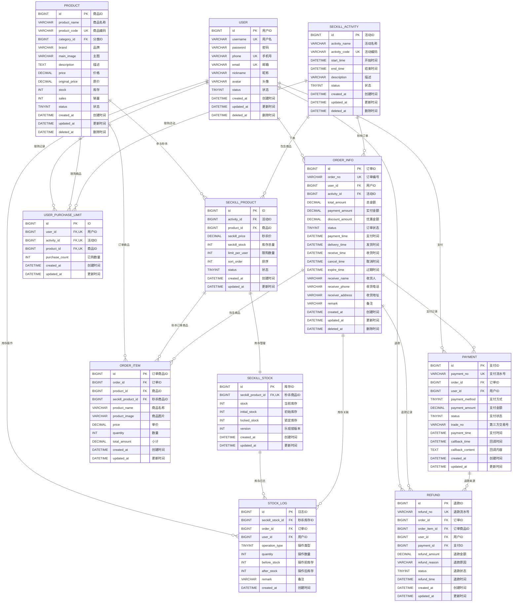

# 秒杀活动电商订单系统 - ER图

## 数据库实体关系图



## 表关系说明

### 核心关系链

1. **用户 → 订单 → 支付 → 退款**
   - 用户可以创建多个订单
   - 每个订单可以有多个支付记录（支付失败重试）
   - 每个支付可以发起多次退款

2. **活动 → 秒杀商品 → 库存 → 订单商品**
   - 一个秒杀活动包含多个秒杀商品
   - 每个秒杀商品有独立的库存管理
   - 订单商品关联秒杀商品（秒杀订单）

3. **用户 → 购买限制 → 活动+商品**
   - 唯一索引 (user_id, activity_id, product_id) 确保限购

### 防超卖机制

```sql
-- 扣减库存（乐观锁）
UPDATE seckill_stock 
SET stock = stock - ?, version = version + 1 
WHERE seckill_product_id = ? 
  AND stock >= ? 
  AND version = ?;

-- 如果影响行数为0，说明：
-- 1. 库存不足
-- 2. 版本号不匹配（并发冲突）
```

### 订单状态流转

```
0-待支付 → 1-已支付 → 2-已发货 → 3-已完成
    ↓          ↓
4-已取消   5-已退款
```

### 索引设计原则

1. **主键索引**：所有表使用 `BIGINT UNSIGNED AUTO_INCREMENT`
2. **唯一索引**：订单号、支付流水号、退款流水号等业务主键
3. **外键索引**：所有外键字段自动创建索引
4. **查询优化**：status、created_at 等高频查询字段
5. **联合索引**：user_id + activity_id + product_id（限购控制）

## 在线预览

### 方式1：Mermaid Live Editor
访问 [Mermaid Live Editor](https://mermaid.live)，粘贴上面的代码即可查看交互式ER图。

### 方式2：VS Code
安装 "Markdown Preview Mermaid Support" 插件，在Markdown预览中查看。

### 方式3：GitHub/GitLab
直接在Markdown文件中使用 `mermaid` 代码块，平台会自动渲染。

## 数据库连接信息

- **Host**: 115.190.43.83
- **Port**: 3306
- **Database**: p2308a
- **Username**: root
- **Charset**: utf8mb4

## 建表SQL文件

完整建表脚本：`database/seckill_schema.sql`